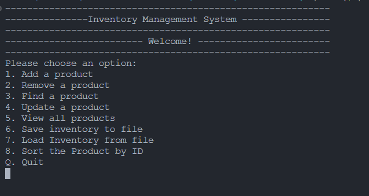

# Inventory Management System

This program is an Inventory Management System built in C++ that allows users to manage product information efficiently.

## Features

- **Add a product:** Add a new product to the inventory by providing ID, name, category, price, and quantity.
- **Remove a product:** Remove a product from the inventory by its ID.
- **Find a product:** Search for a product in the inventory by its ID and view its details.
- **Update a product:** Modify the details of a product in the inventory.
- **View all products:** Display all the products along with their details.
- **Save and Load from file:** Save the inventory to a file and load inventory from a file (CSV format).

## Instructions

1. Run the program.
2. Choose options by entering the corresponding number:
   - **1:** Add a product
   - **2:** Remove a product
   - **3:** Find a product
   - **4:** Update a product
   - **5:** View all products
   - **6:** Save inventory to file
   - **7:** Load inventory from file
   - **8:** Sort the products by ID
   - **Q:** Quit the program

## Usage

- When prompted, enter the required information according to the chosen option.
- Follow the on-screen instructions to manage the inventory effectively.

## File Structure

- `main.cpp`: Contains the main code for the Inventory Management System.
- `inventory1.csv`: Sample file to store inventory data.

## Requirements

- C++ compiler (supporting C++11)

## CLI Interface

- 

## Contributors

- [AshishKukreti2003](https://github.com/AshishKukreti2003)

Feel free to contribute or raise issues if you encounter any problems.
